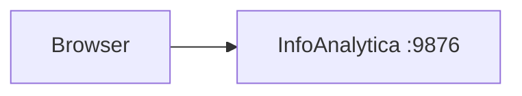
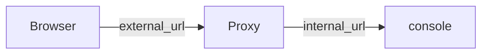
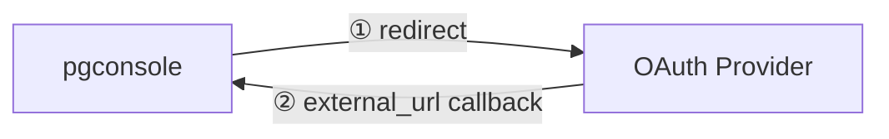

InfoAnalytica listens on port `9876` by default (configurable via `--port`). You can access it directly or put it behind a reverse proxy.

## Direct Access

Users access InfoAnalytica directly at its host and port.



No additional configuration is needed.

## Behind a Reverse Proxy

A reverse proxy handles TLS termination and exposes pgconsole on a public domain. Set [`external_url`](/configuration/config#general) in `pgconsole.toml` to the public-facing URL so that pgconsole constructs correct OAuth callback URLs.

```toml pgconsole.toml
[general]
external_url = "https://console.infoanalytica.com"
```



### Nginx

```nginx
server {
    server_name console.infoanalytica.com;

    location / {
        proxy_pass http://localhost:9876;
        proxy_set_header Host $host;
        proxy_set_header X-Real-IP $remote_addr;
        proxy_set_header X-Forwarded-For $proxy_add_x_forwarded_for;
        proxy_set_header X-Forwarded-Proto $scheme;
    }
}
```

### Caddy

Caddy provides automatic HTTPS with Let's Encrypt.

```caddy
console.infoanalytica.com {
    reverse_proxy localhost:9876
}
```

### Kubernetes Ingress

Use an Ingress resource to expose pgconsole with TLS termination inside a Kubernetes cluster.

```yaml
apiVersion: networking.k8s.io/v1
kind: Ingress
metadata:
  name: infoanalytica-ingress
  annotations:
    nginx.ingress.kubernetes.io/ssl-redirect: "true"
spec:
  ingressClassName: nginx
  tls:
    - hosts:
        - console.infoanalytica.com
      secretName: infoanalytica-tls
  rules:
    - host: console.infoanalytica.com
      http:
        paths:
          - path: /
            pathType: Prefix
            backend:
              service:
                name: infoanalytica
                port:
                  number: 9876
```

The `infoanalytica-tls` Secret holds your TLS certificate. If you use [cert-manager](https://cert-manager.io/), add the annotation `cert-manager.io/cluster-issuer` to provision it automatically.

### Kubernetes Gateway API

The [Gateway API](https://gateway-api.sigs.k8s.io/) is the successor to Ingress. Define a Gateway for TLS termination and an HTTPRoute for routing:

```yaml
apiVersion: gateway.networking.k8s.io/v1
kind: Gateway
metadata:
  name: infoanalytica-gateway
spec:
  gatewayClassName: nginx
  listeners:
    - name: https
      protocol: HTTPS
      port: 443
      hostname: console.infoanalytica.com
      tls:
        mode: Terminate
        certificateRefs:
          - name: infoanalytica-tls
    - name: http-redirect
      protocol: HTTP
      port: 80
      hostname: console.infoanalytica.com
---
apiVersion: gateway.networking.k8s.io/v1
kind: HTTPRoute
metadata:
  name: infoanalytica-route
spec:
  parentRefs:
    - name: infoanalytica-gateway
  hostnames:
    - console.infoanalytica.com
  rules:
    - backendRefs:
        - name: infoanalytica
          port: 9876
```

## OAuth Callback

When SSO is configured, `external_url` is used to construct the OAuth callback URL. The OAuth provider redirects users back to `external_url` after authentication.


